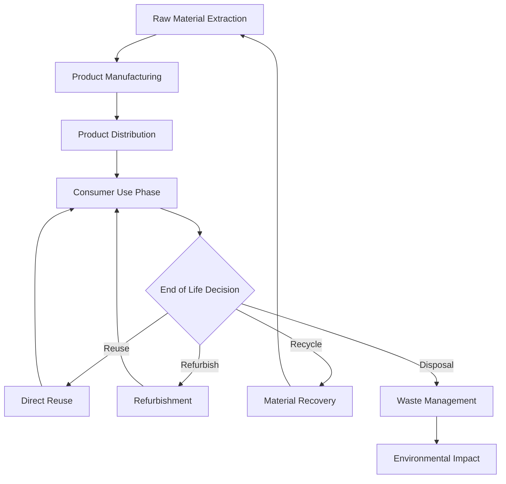

# Tokenized Circular Economy Platform

A blockchain-based ecosystem that enables complete material traceability and optimizes resource flows in the circular economy. This platform tokenizes physical products and materials, creating transparent value chains that incentivize sustainable practices and maximize resource utilization.

## 🌱 System Overview

The Tokenized Circular Economy Platform consists of five interconnected smart contracts that create a comprehensive ecosystem for sustainable material management:

- **Product Verification Contract**: Validates and certifies products entering the circular ecosystem
- **Material Passport Contract**: Creates immutable records of material composition and properties
- **Usage Tracking Contract**: Monitors product lifecycle stages and performance metrics
- **Reclamation Contract**: Manages end-of-life recovery, refurbishment, and recycling processes
- **Value Chain Contract**: Tracks material flows and value creation across industries and stakeholders

## 🎯 Key Features

### Product Authentication & Tokenization
- Unique digital product passports with tamper-proof verification
- QR code and NFC integration for physical-digital linking
- Batch tracking for mass-produced items
- Authenticity verification to prevent counterfeiting
- Multi-stakeholder verification protocols

### Comprehensive Material Intelligence
- Detailed material composition tracking (elements, compounds, additives)
- Sustainability metrics and environmental impact scoring
- Material quality degradation modeling
- Compatibility matrices for material combinations
- Recycling potential assessment and optimization

### Lifecycle Performance Monitoring
- Real-time usage analytics and wear pattern tracking
- Predictive maintenance recommendations
- Performance benchmarking against similar products
- Carbon footprint tracking throughout lifecycle
- User behavior analysis for design optimization

### Intelligent End-of-Life Management
- Automated reclamation value assessment
- Multi-pathway recovery optimization (reuse, refurbish, recycle)
- Geographic optimization for collection and processing
- Quality grading for recovered materials
- Stakeholder matching for material redistribution

### Cross-Industry Value Networks
- Material exchange marketplace with dynamic pricing
- Supply chain transparency and provenance tracking
- Collaborative sustainability initiatives
- Impact measurement and ESG reporting
- Incentive mechanisms for circular practices

## 📋 Prerequisites

- Node.js (v18.0 or higher)
- Hardhat or Foundry for smart contract development
- Web3.js or Ethers.js for blockchain interaction
- IPFS for distributed metadata and document storage
- IoT sensor integration capabilities
- Oracle services for real-world data feeds

## 🚀 Installation

1. **Clone the repository**
   ```bash
   git clone https://github.com/circular-economy/tokenized-platform
   cd tokenized-platform
   ```

2. **Install dependencies**
   ```bash
   npm install
   ```

3. **Configure environment**
   ```bash
   cp .env.example .env
   # Configure blockchain network, IPFS, IoT integrations
   ```

4. **Deploy smart contracts**
   ```bash
   npx hardhat compile
   npx hardhat run scripts/deploy.js --network <sustainability-network>
   ```

5. **Initialize platform data**
   ```bash
   npm run setup-materials-database
   npm run configure-industries
   npm run initialize-standards
   ```

## 🏗️ Smart Contract Architecture

### Product Verification Contract
```solidity
// Product Authentication & Certification
- registerProduct(productData, verificationProof): Create verified product token
- certifyManufacturer(manufacturerId, certificationData): Validate producer credentials
- verifyProductAuthenticity(productId, physicalMarkers): Confirm physical-digital link
- updateProductStatus(productId, status, evidence): Modify verification state
- revokeVerification(productId, reason): Remove authenticity guarantee
- getVerificationHistory(productId): Retrieve complete verification timeline
```

### Material Passport Contract
```solidity
// Material Composition & Properties
- createMaterialPassport(productId, compositionData): Document material makeup
- updateComposition(passportId, changes, reason): Modify material information
- addMaterialProperty(passportId, property, value): Enhance material data
- calculateRecyclability(passportId): Assess end-of-life potential
- trackMaterialSupply(materialType, supplierData): Monitor source materials
- generateCompatibilityMatrix(materials[]): Analyze material interactions
```

### Usage Tracking Contract
```solidity
// Lifecycle Monitoring & Analytics
- recordUsageEvent(productId, eventData, timestamp): Log product utilization
- updatePerformanceMetrics(productId, metrics): Track degradation and efficiency
- setMaintenanceSchedule(productId, schedule): Plan lifecycle interventions
- calculateCarbonFootprint(productId, usageData): Measure environmental impact
- predictLifespanRemaining(productId): Estimate remaining useful life
- generateUsageReport(productId, timeRange): Create performance summary
```

### Reclamation Contract
```solidity
// End-of-Life Recovery Management
- initiateReclamation(productId, reclamationType): Begin recovery process
- assessReclamationValue(productId, condition): Evaluate recovery potential
- scheduleCollection(productId, location, timeframe): Arrange product pickup
- processReclamation(productId, methodUsed, outputs): Record recovery activities
- distributeRecoveredMaterials(materials[], recipients): Allocate recovered resources
- calculateReclamationROI(productId, costs, value): Measure recovery efficiency
```

### Value Chain Contract
```solidity
// Cross-Industry Material Flows
- trackMaterialFlow(materialId, fromEntity, toEntity): Record ownership transfers
- createValueExchange(sellerId, buyerId, materials, price): Facilitate material trades
- calculateValueCreation(valueChainId, timeRange): Measure economic impact
- optimizeSupplyChain(industryId, constraints): Suggest efficiency improvements
- measureCircularityMetrics(organizationId): Calculate circular economy KPIs
- rewardSustainablePractices(entityId, actions): Incentivize positive behaviors
```

## 💼 Usage Examples

### Registering a New Product with Material Passport
```javascript
const productData = {
  name: "EcoSmart Smartphone Case",
  manufacturer: "GreenTech Industries",
  model: "ES-SC-2025",
  category: "electronics_accessories",
  productionDate: "2025-05-15",
  serialNumber: "GT2025ES001234",
  physicalMarkers: {
    qrCode: "QR789012345",
    nfcTag: "NFC456789012",
    microprint: "MP2025GT"
  }
};

const verificationProof = {
  manufacturerCertificate: "0x1234...cert",
  qualityTestResults: "0x5678...tests",
  sustainabilityCertification: "0x9abc...sustain"
};

// Register product and create token
const productTx = await productVerification.registerProduct(productData, verificationProof);
const productId = await productTx.wait().events[0].args.productId;

// Create material passport
const compositionData = {
  materials: [
    {
      type: "bioplastic_pla",
      percentage: 70,
      grade: "food_grade",
      supplier: "BioPoly Corp",
      certifications: ["compostable", "bio_based"],
      properties: {
        density: 1.24,
        meltingPoint: 180,
        tensileStrength: 50
      }
    },
    {
      type: "recycled_aluminum",
      percentage: 25,
      grade: "6061_alloy",
      supplier: "RecycleAl Ltd",
      certifications: ["post_consumer", "cradle_to_cradle"],
      properties: {
        purity: 99.5,
        corrosionResistance: "excellent"
      }
    },
    {
      type: "natural_fiber",
      percentage: 5,
      grade: "hemp_fiber",
      supplier: "EcoFiber Co",
      certifications: ["organic", "fair_trade"]
    }
  ],
  sustainabilityMetrics: {
    carbonFootprint: 2.1, // kg CO2 equivalent
    recyclabilityScore: 0.85,
    renewableContent: 0.75,
    toxicityRating: "low"
  }
};

await materialPassport.createMaterialPassport(productId, compositionData);
```

### Tracking Product Usage and Performance
```javascript
const usageEvent = {
  eventType: "daily_usage",
  duration: 8.5, // hours
  conditions: {
    temperature: 23, // Celsius
    humidity: 45, // percentage
    dropCount: 2,
    pressureExposure: "normal"
  },
  location: {
    country: "USA",
    climate: "temperate"
  },
  userBehavior: {
    careLevel: "high",
    usageIntensity: "moderate"
  }
};

await usageTracking.recordUsageEvent(productId, usageEvent, Date.now());

// Update performance metrics
const performanceMetrics = {
  structuralIntegrity: 0.98, // 98% of original strength
  aestheticCondition: 0.92,  // 92% of original appearance
  functionalPerformance: 0.99,
  estimatedRemainingLife: 0.75, // 75% of expected lifespan remaining
  maintenanceRequired: false
};

await usageTracking.updatePerformanceMetrics(productId, performanceMetrics);
```

### Initiating End-of-Life Reclamation
```javascript
const reclamationData = {
  condition: {
    overall: "good",
    structuralIntegrity: 0.85,
    aestheticCondition: 0.60,
    functionalStatus: "working",
    contamination: "none"
  },
  preferredMethod: "material_recovery",
  location: {
    address: "123 Green Street, EcoCity, State 12345",
    coordinates: { lat: 40.7128, lng: -74.0060 }
  },
  urgency: "standard",
  specialRequirements: {
    disassemblyNeeded: true,
    hazardousMaterials: false,
    dataDeletion: false
  }
};

const reclamationTx = await reclamationContract.initiateReclamation(
  productId,
  "comprehensive_recovery"
);

// Assess reclamation value
const valueAssessment = await reclamationContract.assessReclamationValue(
  productId,
  reclamationData.condition
);
```

### Processing Recovered Materials in Value Chain
```javascript
const recoveredMaterials = {
  materials: [
    {
      type: "bioplastic_pla",
      quantity: 0.15, // kg
      quality: "grade_a",
      contamination: 0.02, // 2% contamination
      processing: "cleaned_and_pelletized",
      certifications: ["recycled_content"]
    },
    {
      type: "recycled_aluminum",
      quantity: 0.05, // kg
      quality: "grade_a",
      purity: 98.5,
      processing: "melted_and_refined"
    }
  ],
  processDetails: {
    facility: "EcoRecovery Plant #3",
    method: "mechanical_separation",
    energyUsed: 1.2, // kWh
    waterUsed: 0.5,  // liters
    efficiency: 0.88 // 88% material recovery rate
  }
};

await reclamationContract.processReclamation(
  productId,
  "mechanical_recycling",
  recoveredMaterials
);

// Create value exchange for recovered materials
const materialExchange = {
  sellerId: "EcoRecovery_Plant_3",
  buyerId: "NewProduct_Manufacturer",
  materials: recoveredMaterials.materials,
  pricePerKg: {
    bioplastic_pla: 2.50,
    recycled_aluminum: 1.80
  },
  qualityGuarantee: "grade_a_certified",
  deliveryTerms: "FOB_facility"
};

await valueChain.createValueExchange(
  materialExchange.sellerId,
  materialExchange.buyerId,
  materialExchange.materials,
  materialExchange.pricePerKg
);
```

## 📊 Circular Economy Metrics

### Material Flow Analysis


### Circularity Indicators
```javascript
const circularityMetrics = {
  materialUtilizationRate: 0.92,    // 92% of materials actively used
  circularMaterialRatio: 0.68,     // 68% from circular sources
  lifespanExtensionFactor: 1.4,    // 40% longer than linear products
  valueRetentionRate: 0.75,        // 75% of value retained through cycles
  environmentalImpactReduction: 0.55 // 55% lower environmental impact
};
```

### Value Creation Tracking
```javascript
const valueMetrics = {
  economicValueCreated: {
    materialSavings: 150000,        // USD saved through circularity
    newRevenueStreams: 320000,      // USD from circular services
    costAvoidance: 95000            // USD avoided waste disposal costs
  },
  environmentalValue: {
    carbonReduced: 450,             // tons CO2 equivalent
    wasteAvoided: 1200,            // tons diverted from landfill
    waterSaved: 25000,             // liters conserved
    energySaved: 180000            // kWh saved through efficiency
  },
  socialValue: {
    jobsCreated: 45,               // new circular economy jobs
    skillsDeveloped: 120,          // workers trained in circular practices
    communityBenefit: 25000        // USD local economic impact
  }
};
```

## 🌐 Stakeholder Ecosystem

### Manufacturers & Producers
- Product design optimization for circularity
- Material sourcing from circular flows
- Take-back program management
- Sustainability reporting and compliance
- Circular business model development

### Consumers & Users
- Product authenticity verification
- Usage optimization recommendations
- End-of-life guidance and incentives
- Sustainability impact tracking
- Circular product marketplace access

### Recyclers & Processors
- Material quality assessment tools
- Recovery process optimization
- Market matching for recovered materials
- Performance tracking and certification
- Revenue optimization through data insights

### Policymakers & Regulators
- Circular economy policy impact measurement
- Extended producer responsibility compliance
- Waste reduction target monitoring
- Sustainability incentive program management
- Environmental impact assessment

## 🔄 Process Automation

### Automated Lifecycle Management
```javascript
// Automated maintenance reminders
const maintenanceAutomation = {
  triggers: {
    usageThreshold: 1000, // hours of use
    performanceDegradation: 0.15, // 15% performance drop
    timeInterval: 6 // months
  },
  actions: {
    notifyUser: true,
    scheduleService: true,
    orderReplacementParts: false,
    updatePassport: true
  }
};

// Automated reclamation initiation
const reclamationAutomation = {
  triggers: {
    endOfLifeReached: true,
    performanceBelow: 0.50,
    userRequested: true,
    safetyThreshold: 0.30
  },
  actions: {
    assessReclamationValue: true,
    findOptimalProcessor: true,
    scheduleCollection: true,
    initiateValueRecovery: true
  }
};
```

### Smart Contract Oracles
```javascript
// Real-world data integration
const oracleFeeds = {
  materialPrices: "commodity_markets_oracle",
  environmentalData: "sustainability_metrics_oracle",
  qualityStandards: "certification_bodies_oracle",
  logisticsData: "supply_chain_oracle",
  regulatoryUpdates: "policy_monitoring_oracle"
};
```

## 📱 Platform Applications

### Manufacturer Dashboard
- Product portfolio circularity analysis
- Supply chain sustainability metrics
- Design optimization recommendations
- Regulatory compliance tracking
- Circular revenue stream analytics

### Consumer Mobile App
```javascript
// Key features for end users
const consumerFeatures = {
  productVerification: "QR/NFC scanning for authenticity",
  usageOptimization: "Personalized recommendations for product care",
  impactTracking: "Individual sustainability footprint",
  reclamationRewards: "Incentives for proper end-of-life handling",
  circularMarketplace: "Buy/sell verified circular products"
};
```

### Recycler Platform
- Material quality assessment tools
- Processing optimization algorithms
- Market matching for recovered materials
- Certification and compliance management
- Performance analytics and reporting

## 🧪 Testing & Validation

### Smart Contract Testing
```bash
npm run test:product-verification    # Test product authentication
npm run test:material-passport      # Test composition tracking
npm run test:usage-tracking         # Test lifecycle monitoring
npm run test:reclamation           # Test end-of-life management
npm run test:value-chain           # Test cross-industry flows
npm run test:integration           # Full system integration tests
```

### Sustainability Impact Validation
```bash
npm run validate:carbon-tracking    # Verify carbon footprint calculations
npm run validate:circularity       # Test circularity metrics
npm run validate:value-creation     # Measure economic impact
npm run validate:compliance        # Check regulatory compliance
```

## 📈 Analytics & Insights

### Circular Economy Dashboard
```javascript
const platformAnalytics = {
  totalProductsTracked: 125000,
  materialsInCirculation: {
    plastics: { quantity: 45000, circularityRate: 0.72 },
    metals: { quantity: 15000, circularityRate: 0.85 },
    textiles: { quantity: 30000, circularityRate: 0.45 },
    electronics: { quantity: 8000, circularityRate: 0.60 }
  },
  valueCreated: {
    economicValue: 15000000, // USD
    environmentalValue: 8500000, // USD equivalent
    socialValue: 2200000 // USD equivalent
  },
  circularityTrends: {
    monthlyGrowth: 0.085, // 8.5% monthly increase
    industryLeaders: ["electronics", "automotive", "fashion"],
    emergingOpportunities: ["construction", "packaging", "furniture"]
  }
};
```

### Predictive Modeling
- Demand forecasting for recycled materials
- Product lifespan optimization models
- Circular economy scenario planning
- Policy impact simulation
- Technology adoption predictions

## 🚀 Deployment & Scaling

### Network Architecture
```bash
# Development deployment
npm run deploy:development     # Local blockchain testing
npm run deploy:testnet        # Public testnet deployment

# Production deployment
npm run deploy:mainnet        # Main blockchain network
npm run deploy:sidechains     # Specialized circular economy chains
npm run setup:oracles         # Configure real-world data feeds
```

### Scalability Solutions
- Layer 2 solutions for high-frequency transactions
- Sharding for geographic distribution
- IPFS clustering for metadata storage
- Edge computing for IoT data processing
- Interchain protocols for multi-blockchain operation

## 🤝 Governance & Standards

### Circular Economy Standards
- ISO 14006 (Environmental Management - Ecodesign)
- BS 8001 (Circular Economy Framework)
- Ellen MacArthur Foundation Circularity Indicators
- UN Sustainable Development Goals alignment
- Regional regulatory compliance (EU, US, Asia)

### Governance Framework
- Multi-stakeholder governance council
- Technical standards committee
- Sustainability advisory board
- Community voting mechanisms
- Transparent upgrade procedures

### Certification Programs
```javascript
const certificationLevels = {
  bronze: {
    requirements: "Basic circular practices adoption",
    benefits: "Platform access and basic analytics"
  },
  silver: {
    requirements: "Demonstrated circular value creation",
    benefits: "Advanced features and priority matching"
  },
  gold: {
    requirements: "Industry leadership in circularity",
    benefits: "Governance participation and revenue sharing"
  }
};
```

## 📞 Support & Community

### Technical Support
- **Developer Hub**: [developers.circular-platform.org](https://developers.circular-platform.org)
- **API Documentation**: [api.circular-platform.org](https://api.circular-platform.org)
- **Community Forum**: [community.circular-platform.org](https://community.circular-platform.org)
- **Technical Support**: tech-support@circular-platform.org

### Industry Collaboration
- Circular Economy Working Groups
- Standards Development Participation
- Research Institution Partnerships
- Policy Maker Engagement
- International Collaboration Networks

### Training & Education
- Circular design workshops
- Blockchain implementation training
- Sustainability measurement certification
- Business model transformation guidance
- Community ambassador programs

## 📄 Legal & Compliance

This project operates under the Circular Economy Open Source License (CEOSL) - see the [LICENSE](LICENSE) file for details.

### Regulatory Compliance
- Extended Producer Responsibility (EPR) regulations
- Waste Electrical and Electronic Equipment (WEEE) Directive
- Restriction of Hazardous Substances (RoHS) compliance
- REACH regulation for chemical substances
- Regional waste management and recycling laws

### Data Governance
- Material composition data sovereignty
- Cross-border data transfer protocols
- Trade secret protection mechanisms
- Transparency vs. competitive advantage balance
- Intellectual property rights management

## 🚧 Roadmap & Innovation

### Current Phase (Q2 2025)
- ✅ Core smart contract deployment
- ✅ Material passport standard development
- 🔄 Pilot program with manufacturing partners
- 🔄 Mobile app beta testing

### Phase 2 (Q3-Q4 2025)
- ⏳ AI-powered material optimization algorithms
- ⏳ IoT integration for automated tracking
- ⏳ Cross-industry material marketplace
- ⏳ Advanced analytics and prediction models

### Phase 3 (2026)
- ⏳ Global standard adoption and interoperability
- ⏳ Policy integration and regulatory compliance automation
- ⏳ DeFi integration for circular economy financing
- ⏳ Carbon credit and environmental impact tokenization

### Future Vision (2027+)
- Autonomous circular economy networks
- AI-driven product design optimization
- Global material flow optimization
- Regenerative economy integration
- Space economy circular principles

## 🌍 Impact & Sustainability

### Environmental Benefits
- **Waste Reduction**: 75% decrease in landfill waste from tracked products
- **Carbon Footprint**: 60% reduction in lifecycle emissions
- **Resource Efficiency**: 80% improvement in material utilization
- **Biodiversity**: Reduced pressure on natural resource extraction
- **Pollution Prevention**: Lower toxic material release through controlled flows

### Economic Advantages
- **Cost Savings**: 40% reduction in raw material costs
- **New Revenue**: Circular service business models
- **Job Creation**: Green economy employment opportunities
- **Innovation**: Technology development and competitive advantage
- **Risk Mitigation**: Supply chain resilience and resource security

### Social Impact
- **Community Development**: Local circular economy initiatives
- **Education**: Sustainability awareness and skill development
- **Equity**: Fair access to circular economy benefits
- **Health**: Reduced environmental health impacts
- **Future Generations**: Sustainable resource stewardship

---

*Building a regenerative future through circular innovation* 🌱♻️
